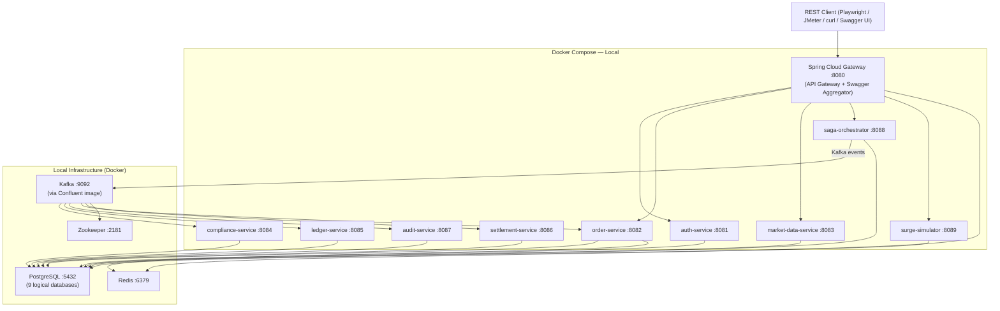

# EquiFlow — Product & Technical Specification
**Version:** 1.2
**Status:** Approved
**Last Updated:** 2026-03-09
**Changes from v1.1:** Removed all cloud/deployment infrastructure. Project is local-only (Docker Compose). Replaced AWS services with local equivalents.

---

## Table of Contents
1. [Executive Summary](#1-executive-summary)
2. [User Personas & Access Control](#2-user-personas--access-control)
3. [System Architecture](#3-system-architecture)
4. [Microservices — Detailed Breakdown](#4-microservices--detailed-breakdown)
   - 4.1 auth-service
   - 4.2 order-service
   - 4.3 market-data-service
   - 4.4 compliance-service
   - 4.5 ledger-service
   - 4.6 settlement-service
   - 4.7 audit-service
   - 4.8 saga-orchestrator
   - 4.9 surge-simulator
5. [Swagger / OpenAPI](#5-swagger--openapi)
6. [Kafka Event Bus](#6-kafka-event-bus)
7. [Database Design](#7-database-design)
8. [Compliance Rules](#8-compliance-rules)
9. [Market Data & Price Feed](#9-market-data--price-feed)
10. [Order Book & Matching Engine](#10-order-book--matching-engine)
11. [Settlement & Business Calendar](#11-settlement--business-calendar)
12. [Testing Strategy](#12-testing-strategy)
13. [Local Development Setup](#13-local-development-setup)
14. [Non-Goals](#14-non-goals)
15. [Failure Mode Matrix](#15-failure-mode-matrix)
16. [Repository Structure](#16-repository-structure)

---

## 1. Executive Summary

**EquiFlow** is a high-integrity US equity trading engine built on Java 21 and Spring Boot 3.x microservices. It is a **local development and test-writing project** — it will never be deployed to a cloud environment.

The system simulates a production-grade brokerage backend with:

- Real order book matching (bid/ask) with a simulated market maker
- SEC/FINRA-style compliance enforcement (wash-sale rules, sufficient funds)
- T+1 settlement with NYSE business calendar
- Saga-orchestrated distributed transactions over Kafka
- Chaos engineering via an admin-controlled Surge Simulator
- Full observability: Allure dashboards, immutable audit logs, aggregated Swagger UI

**It is a pure REST API backend.** There is no UI. All interaction is via HTTP endpoints documented in Swagger at `http://localhost:8080/swagger-ui.html`.

Everything runs locally via **Docker Compose**. No AWS, no Kubernetes, no CI/CD pipeline.

**Scope (v1):** US equities (stocks) only. Mutual Funds, Bonds, and Slack notifications are out of scope for v1.

---

## 2. User Personas & Access Control

### Roles

| Role | Username (pre-seeded) | Password | Permissions |
|---|---|---|---|
| `TRADER` | `trader1` | `password123` | Submit orders, view own positions, view own order history |
| `REGULATOR` | `regulator1` | `password123` | Read-only access to audit log, all orders, all accounts |
| `BOT_OPERATOR` | `bot-operator1` | `password123` | Admin APIs: chaos injection, market scenarios, system health |

### Authentication
- JWT (JSON Web Token), self-signed RSA key pair
- Issued by `auth-service` via `POST /auth/token`
- Token expiry: **1 hour**
- All services validate JWT using shared RSA public key (no inter-service auth calls at runtime)
- No user registration endpoint — users are seeded at startup via a Flyway migration script

---

## 3. System Architecture

### Architecture Diagram (Mermaid.js)



### Key Architectural Decisions

| Decision | Choice | Rationale |
|---|---|---|
| Inter-service communication | Kafka (async Saga) + Spring Cloud OpenFeign (sync queries) | Saga requires async; some reads (e.g. price lookup) are sync |
| API Gateway | Spring Cloud Gateway | Centralized routing, JWT validation, Swagger aggregation |
| Service discovery | Docker Compose DNS (service names) | Simple, zero config for local |
| Config management | `application.yml` per service + `.env` file | Sufficient for local-only project |
| Secrets | `.env` file checked into `.gitignore` | Local only, no secret manager needed |
| Saga type | Orchestration (central coordinator) | Easier to trace, explicit rollback logic |
| API Documentation | springdoc-openapi + Gateway aggregation | Single Swagger UI at `:8080` for all 9 services |

---

## 4. Microservices — Detailed Breakdown

---

### 4.1 auth-service

**Port:** 8081
**Database:** `equiflow_auth`
**Responsibility:** Issues and validates JWT tokens. Manages pre-seeded user accounts.

#### Endpoints

| Method | Path | Role | Description |
|---|---|---|---|
| `POST` | `/auth/token` | Public | Issue JWT (username + password) |
| `GET` | `/auth/validate` | Internal | Validate token (used by Gateway) |
| `GET` | `/auth/users` | `BOT_OPERATOR` | List all seeded users |

#### Key Logic
- On startup, Flyway seeds `trader1`, `regulator1`, `bot-operator1` with bcrypt-hashed passwords
- JWT payload includes: `sub` (username), `role`, `iat`, `exp`
- RSA public key exposed at `GET /auth/.well-known/jwks.json` for other services

#### Data Model
```
users
  id            UUID PRIMARY KEY
  username      VARCHAR(50) UNIQUE NOT NULL
  password_hash VARCHAR(255) NOT NULL
  role          ENUM('TRADER','REGULATOR','BOT_OPERATOR') NOT NULL
  created_at    TIMESTAMP NOT NULL
  last_login_at TIMESTAMP
```

---

### 4.2 order-service

**Port:** 8082
**Database:** `equiflow_orders`
**Responsibility:** Order submission, order book management, matching engine, market hours enforcement.

#### Endpoints

| Method | Path | Role | Description |
|---|---|---|---|
| `POST` | `/orders` | `TRADER`, `BOT_OPERATOR` | Submit a new order |
| `GET` | `/orders/{orderId}` | `TRADER`, `REGULATOR` | Get order by ID |
| `GET` | `/orders` | `TRADER`, `REGULATOR` | List orders (trader sees own; regulator sees all) |
| `DELETE` | `/orders/{orderId}` | `TRADER` | Cancel a pending limit order |
| `GET` | `/orders/book/{ticker}` | `BOT_OPERATOR` | View current order book for a ticker |

#### Order Types
- `MARKET` — executes immediately at current market price
- `LIMIT` — enters order book, executes only at `limitPrice` or better

#### Order Statuses
| Status | Description |
|---|---|
| `PENDING` | Submitted, awaiting Saga start |
| `COMPLIANCE_CHECK` | Being evaluated by compliance-service |
| `OPEN` | In order book, awaiting match |
| `FILLED` | Fully matched and executed |
| `PARTIALLY_FILLED` | Some quantity matched |
| `CANCELLED` | Cancelled by user or expired at EOD |
| `REJECTED` | Blocked by compliance or market hours |
| `FAILED` | System error mid-Saga |

#### Market Hours Enforcement
- NYSE hours: **9:30 AM – 4:00 PM Eastern Time**
- Orders outside hours return `HTTP 422` with error code `MARKET_CLOSED`
- System is timezone-aware (converts to ET regardless of server timezone)

#### Matching Engine (internal component)
- One in-memory order book per ticker (30 books total), backed by DB snapshot
- **Market order flow:**
  1. Check opposing limit orders in book (best price first)
  2. Match as much quantity as possible against existing limits
  3. Fill remaining quantity via simulated market maker at current market price
- **Limit order flow:**
  1. Check opposing limit orders at compatible price
  2. Match if found; enter queue if not
  3. Expire all unfilled limit orders at **4:00 PM ET** (day orders only)
- No fractional shares — quantity must be a positive integer

#### Data Model
```
orders
  id             UUID PRIMARY KEY
  user_id        UUID NOT NULL
  ticker         VARCHAR(10) NOT NULL
  side           ENUM('BUY','SELL') NOT NULL
  type           ENUM('MARKET','LIMIT') NOT NULL
  quantity       INTEGER NOT NULL
  limit_price    DECIMAL(12,4)
  filled_price   DECIMAL(12,4)
  filled_qty     INTEGER DEFAULT 0
  status         ENUM(...) NOT NULL
  saga_id        UUID
  created_at     TIMESTAMP NOT NULL
  expires_at     TIMESTAMP NOT NULL
  updated_at     TIMESTAMP NOT NULL

order_book_entries
  id             UUID PRIMARY KEY
  order_id       UUID REFERENCES orders(id)
  ticker         VARCHAR(10) NOT NULL
  side           ENUM('BUY','SELL') NOT NULL
  quantity       INTEGER NOT NULL
  remaining_qty  INTEGER NOT NULL
  limit_price    DECIMAL(12,4) NOT NULL
  created_at     TIMESTAMP NOT NULL
```

---

### 4.3 market-data-service

**Port:** 8083
**Database:** `equiflow_market`
**Responsibility:** Simulated price feed for 30 hardcoded tickers. Scripted price scenario engine.

#### Supported Tickers (30)
```
Tech:    AAPL, MSFT, GOOGL, AMZN, META, NVDA, NFLX, AMD, INTC, CRM
Finance: JPM, BAC, GS, WFC, MS, BLK, C, AXP
Health:  JNJ, PFE, UNH, ABBV, MRK
Energy:  XOM, CVX, COP
Retail:  WMT, TGT, COST, HD
```

#### Endpoints

| Method | Path | Role | Description |
|---|---|---|---|
| `GET` | `/market/price/{ticker}` | Any authenticated | Get current simulated price |
| `GET` | `/market/prices` | Any authenticated | Get all 30 ticker prices |
| `GET` | `/market/scenarios` | `BOT_OPERATOR` | List available named scenarios |
| `POST` | `/admin/market/scenario/{scenarioName}` | `BOT_OPERATOR` | Trigger a named price scenario |
| `POST` | `/admin/market/scenario/stop` | `BOT_OPERATOR` | Stop active scenario, return to baseline |

#### Price Scenarios (defined in `scenarios.yml`)

| Scenario Name | Description |
|---|---|
| `flash-crash` | AAPL drops 15% in 10 seconds, recovers over 60 seconds |
| `bull-surge` | All tech tickers rise 5% over 30 seconds |
| `volatility-spike` | All tickers oscillate ±3% randomly for 60 seconds |
| `market-open-pump` | All tickers gap up 2% at scenario start, then normalize |
| `single-ticker-halt` | TSLA price frozen at last value for 30 seconds |
| `sector-rotation` | Energy tickers +8%, Tech tickers -4% simultaneously |

#### scenarios.yml Structure
```yaml
scenarios:
  flash-crash:
    tickers: [AAPL]
    steps:
      - at_second: 0
        action: CHANGE_PRICE
        delta_pct: -15
      - at_second: 60
        action: RESTORE_BASELINE
```

#### Data Model
```
ticker_prices
  ticker         VARCHAR(10) PRIMARY KEY
  current_price  DECIMAL(12,4) NOT NULL
  baseline_price DECIMAL(12,4) NOT NULL
  updated_at     TIMESTAMP NOT NULL

scenario_events
  id             UUID PRIMARY KEY
  scenario_name  VARCHAR(100) NOT NULL
  triggered_by   VARCHAR(50) NOT NULL
  started_at     TIMESTAMP NOT NULL
  ended_at       TIMESTAMP
  status         ENUM('RUNNING','COMPLETED','STOPPED') NOT NULL
```

---

### 4.4 compliance-service

**Port:** 8084
**Database:** `equiflow_compliance`
**Responsibility:** Enforces two hard-block rules before any order executes.

#### Rules

##### Rule 1 — Sufficient Funds
- `BUY`: available cash ≥ `quantity × current_price`
- `SELL`: available shares ≥ `quantity`
- Rejection code: `INSUFFICIENT_FUNDS`

##### Rule 2 — Wash-Sale Block
- Trader cannot buy ticker X within 30 days of selling ticker X at a loss
- Rejection code: `WASH_SALE_VIOLATION`

#### Endpoints

| Method | Path | Role | Description |
|---|---|---|---|
| `POST` | `/compliance/check` | Internal (Saga) | Run compliance check for an order |
| `GET` | `/compliance/violations/{userId}` | `REGULATOR` | List all violations for a user |

#### Data Model
```
compliance_checks
  id            UUID PRIMARY KEY
  order_id      UUID NOT NULL
  user_id       UUID NOT NULL
  ticker        VARCHAR(10) NOT NULL
  result        ENUM('APPROVED','REJECTED') NOT NULL
  violations    JSONB
  checked_at    TIMESTAMP NOT NULL

wash_sale_history
  id            UUID PRIMARY KEY
  user_id       UUID NOT NULL
  ticker        VARCHAR(10) NOT NULL
  sale_date     DATE NOT NULL
  sale_price    DECIMAL(12,4) NOT NULL
  cost_basis    DECIMAL(12,4) NOT NULL
  loss_amount   DECIMAL(12,4) NOT NULL
  window_end    DATE NOT NULL
  created_at    TIMESTAMP NOT NULL
```

---

### 4.5 ledger-service

**Port:** 8085
**Database:** `equiflow_ledger`
**Responsibility:** Tracks account cash balances, equity positions, and fund holds. Source of truth for portfolio state.

#### Endpoints

| Method | Path | Role | Description |
|---|---|---|---|
| `GET` | `/ledger/accounts/{userId}` | `TRADER`, `REGULATOR` | Get cash balance and positions |
| `POST` | `/ledger/hold` | Internal (Saga) | Reserve funds for a pending order |
| `POST` | `/ledger/release` | Internal (Saga) | Release reserved funds (on cancel/reject) |
| `POST` | `/ledger/debit` | Internal (Saga) | Execute the actual debit/credit on fill |
| `GET` | `/ledger/history/{userId}` | `TRADER`, `REGULATOR` | Transaction history |

#### Fund Hold Flow
1. Saga calls `POST /ledger/hold` → funds reserved
2. On fill → `POST /ledger/debit` → hold converted to debit
3. On rejection/cancel → `POST /ledger/release` → hold removed

#### Data Model
```
accounts
  id              UUID PRIMARY KEY
  user_id         UUID UNIQUE NOT NULL
  cash_balance    DECIMAL(15,4) NOT NULL DEFAULT 100000.00
  cash_on_hold    DECIMAL(15,4) NOT NULL DEFAULT 0.00
  created_at      TIMESTAMP NOT NULL
  updated_at      TIMESTAMP NOT NULL

positions
  id              UUID PRIMARY KEY
  user_id         UUID NOT NULL
  ticker          VARCHAR(10) NOT NULL
  quantity        INTEGER NOT NULL DEFAULT 0
  avg_cost_basis  DECIMAL(12,4)
  updated_at      TIMESTAMP NOT NULL
  UNIQUE(user_id, ticker)

ledger_transactions
  id              UUID PRIMARY KEY
  user_id         UUID NOT NULL
  order_id        UUID
  type            ENUM('HOLD','RELEASE','DEBIT','CREDIT','SETTLEMENT') NOT NULL
  ticker          VARCHAR(10)
  quantity        INTEGER
  amount          DECIMAL(15,4) NOT NULL
  balance_after   DECIMAL(15,4) NOT NULL
  created_at      TIMESTAMP NOT NULL
```

---

### 4.6 settlement-service

**Port:** 8086
**Database:** `equiflow_settlement`
**Responsibility:** Processes T+1 settlement for all filled orders. Runs as a scheduled job at market close.

#### Settlement Schedule
- Runs at **4:00 PM ET daily** (Spring `@Scheduled` cron)
- Skips weekends and 2026 NYSE holidays (hardcoded list)
- T+1 = next business day from trade date

#### 2026 NYSE Holiday Calendar (hardcoded)
```
January 1   — New Year's Day
January 19  — Martin Luther King Jr. Day
February 16 — Presidents' Day
April 3     — Good Friday
May 25      — Memorial Day
June 19     — Juneteenth
July 3      — Independence Day (observed)
September 7 — Labor Day
November 26 — Thanksgiving Day
December 25 — Christmas Day
```

#### Endpoints

| Method | Path | Role | Description |
|---|---|---|---|
| `GET` | `/settlement/pending` | `REGULATOR` | View unsettled trades |
| `GET` | `/settlement/history` | `REGULATOR` | View settlement history |
| `POST` | `/admin/settlement/run` | `BOT_OPERATOR` | Manually trigger settlement job |

#### Data Model
```
settlements
  id              UUID PRIMARY KEY
  order_id        UUID NOT NULL
  user_id         UUID NOT NULL
  ticker          VARCHAR(10) NOT NULL
  quantity        INTEGER NOT NULL
  fill_price      DECIMAL(12,4) NOT NULL
  trade_date      DATE NOT NULL
  settlement_date DATE NOT NULL
  status          ENUM('PENDING_SETTLEMENT','SETTLED','FAILED') NOT NULL
  settled_at      TIMESTAMP
  created_at      TIMESTAMP NOT NULL
```

---

### 4.7 audit-service

**Port:** 8087
**Database:** `equiflow_audit`
**Responsibility:** Append-only, tamper-evident event log.

#### Immutability Enforcement
- PostgreSQL row-level security: `UPDATE` and `DELETE` denied at DB policy level
- Only `INSERT` is permitted
- Every record has an immutable `created_at` timestamp

#### Logged Event Types
| Event Type | Triggered By |
|---|---|
| `ORDER_SUBMITTED` | order-service |
| `COMPLIANCE_APPROVED` | compliance-service |
| `COMPLIANCE_REJECTED` | compliance-service |
| `ORDER_FILLED` | order-service |
| `ORDER_CANCELLED` | order-service |
| `ORDER_EXPIRED` | order-service (EOD sweep) |
| `LEDGER_HOLD_PLACED` | ledger-service |
| `LEDGER_DEBIT_EXECUTED` | ledger-service |
| `SETTLEMENT_COMPLETED` | settlement-service |
| `SAGA_STARTED` | saga-orchestrator |
| `SAGA_FAILED` | saga-orchestrator |
| `SAGA_COMPENSATED` | saga-orchestrator |
| `CHAOS_STARTED` | surge-simulator |
| `CHAOS_STOPPED` | surge-simulator |
| `MARKET_SCENARIO_TRIGGERED` | market-data-service |

#### Endpoints

| Method | Path | Role | Description |
|---|---|---|---|
| `GET` | `/audit/events` | `REGULATOR` | List all events (paginated, filterable) |
| `GET` | `/audit/events/{orderId}` | `REGULATOR` | All events for a specific order |
| `GET` | `/audit/events/user/{userId}` | `REGULATOR` | All events for a specific user |

#### Data Model
```
audit_events
  id           UUID PRIMARY KEY
  event_type   VARCHAR(50) NOT NULL
  order_id     UUID
  user_id      UUID
  saga_id      UUID
  service_name VARCHAR(50) NOT NULL
  payload      JSONB NOT NULL
  created_at   TIMESTAMP NOT NULL
```
> PostgreSQL policy: `DENY UPDATE, DELETE ON audit_events TO equiflow_app_role;`

---

### 4.8 saga-orchestrator

**Port:** 8088
**Database:** `equiflow_saga`
**Responsibility:** Central coordinator for all multi-step order transactions.

#### Saga Flow — Happy Path

```
saga-orchestrator
  Step 1: POST /compliance/check     → compliance-service
  Step 2: Matching engine execution  → order-service (internal)
  Step 3: POST /ledger/debit         → ledger-service
  Step 4: Write settlement record    → settlement-service
  Step 5: Publish audit events       → audit-service (via Kafka)
```

#### Saga Flow — Compensating Rollbacks

| Failed Step | Compensation Actions |
|---|---|
| Step 1 (Compliance rejected) | Set order `REJECTED`, release hold, log to audit |
| Step 2 (Matching failed) | Set order `FAILED`, release hold, log to audit |
| Step 3 (Ledger debit failed) | Reverse match, release hold, log to audit |
| Step 4 (Settlement failed) | Retry 3x; log failure to audit on final attempt |
| Step 5 (Audit failed) | Log warning only — does not roll back the trade |

#### Endpoints

| Method | Path | Role | Description |
|---|---|---|---|
| `GET` | `/saga/{sagaId}` | `BOT_OPERATOR`, `REGULATOR` | Get saga state and step history |
| `GET` | `/saga/active` | `BOT_OPERATOR` | List all active sagas |

#### Data Model
```
sagas
  id              UUID PRIMARY KEY
  order_id        UUID NOT NULL
  status          ENUM('STARTED','COMPLETED','FAILED','COMPENSATING','COMPENSATED') NOT NULL
  current_step    INTEGER NOT NULL
  created_at      TIMESTAMP NOT NULL
  updated_at      TIMESTAMP NOT NULL

saga_steps
  id               UUID PRIMARY KEY
  saga_id          UUID REFERENCES sagas(id)
  step_number      INTEGER NOT NULL
  step_name        VARCHAR(100) NOT NULL
  status           ENUM('PENDING','RUNNING','COMPLETED','FAILED','COMPENSATED') NOT NULL
  request_payload  JSONB
  response_payload JSONB
  started_at       TIMESTAMP
  completed_at     TIMESTAMP
  error_message    TEXT
```

---

### 4.9 surge-simulator

**Port:** 8089
**Database:** `equiflow_chaos`
**Responsibility:** Chaos engineering component. Injects controlled failures to test Saga recovery.

#### Chaos Modes

| Mode | Effect |
|---|---|
| `NETWORK_LATENCY` | Adds configurable delay to all Kafka message publishing |
| `DB_FAILURE` | Randomly fails 30% of PostgreSQL writes via Spring AOP |
| `BOTH` | Combines both modes simultaneously |

#### Endpoints

| Method | Path | Role | Description |
|---|---|---|---|
| `POST` | `/admin/chaos/start` | `BOT_OPERATOR` | Begin chaos injection |
| `POST` | `/admin/chaos/stop` | `BOT_OPERATOR` | Stop all chaos injection |
| `GET` | `/admin/chaos/status` | `BOT_OPERATOR` | Current chaos state and active mode |

#### Implementation Notes
- Uses Spring AOP `@Around` on Kafka template send calls (latency injection)
- Uses Spring AOP on `@Transactional` methods (DB failure injection)
- Auto-stops after `durationSeconds` if not manually stopped

#### Data Model
```
chaos_sessions
  id              UUID PRIMARY KEY
  mode            ENUM('NETWORK_LATENCY','DB_FAILURE','BOTH') NOT NULL
  latency_ms      INTEGER
  db_failure_rate DECIMAL(3,2)
  started_by      VARCHAR(50) NOT NULL
  started_at      TIMESTAMP NOT NULL
  stopped_at      TIMESTAMP
  auto_stop_at    TIMESTAMP
  status          ENUM('ACTIVE','STOPPED') NOT NULL
```

---

## 5. Swagger / OpenAPI

### Setup

**Library:** `springdoc-openapi` v2.x (Spring Boot 3.x compatible)

Each service exposes `GET /v3/api-docs`. The Spring Cloud Gateway aggregates all specs into one Swagger UI.

**Per-service dependency (`pom.xml`):**
```xml
<dependency>
  <groupId>org.springdoc</groupId>
  <artifactId>springdoc-openapi-starter-webmvc-ui</artifactId>
  <version>2.3.0</version>
</dependency>
```

**Gateway dependency (`pom.xml`):**
```xml
<dependency>
  <groupId>org.springdoc</groupId>
  <artifactId>springdoc-openapi-starter-webflux-ui</artifactId>
  <version>2.3.0</version>
</dependency>
```

**Gateway `application.yml`:**
```yaml
springdoc:
  swagger-ui:
    urls:
      - name: auth-service
        url: /auth/v3/api-docs
      - name: order-service
        url: /orders/v3/api-docs
      - name: market-data-service
        url: /market/v3/api-docs
      - name: compliance-service
        url: /compliance/v3/api-docs
      - name: ledger-service
        url: /ledger/v3/api-docs
      - name: settlement-service
        url: /settlement/v3/api-docs
      - name: audit-service
        url: /audit/v3/api-docs
      - name: saga-orchestrator
        url: /saga/v3/api-docs
      - name: surge-simulator
        url: /chaos/v3/api-docs
```

### Local Access URLs

| Resource | URL |
|---|---|
| Swagger UI (all services) | `http://localhost:8080/swagger-ui.html` |
| OpenAPI JSON (per service) | `http://localhost:8080/v3/api-docs/{serviceName}` |

---

### Full Endpoint Catalog with Examples

---

#### auth-service

---

##### `POST /auth/token`
Issues a JWT for a valid username and password.

**Auth required:** None (public)

**Request body:**
```json
{
  "username": "trader1",
  "password": "password123"
}
```

**Response `200 OK`:**
```json
{
  "token": "eyJhbGciOiJSUzI1NiJ9.eyJzdWIiOiJ0cmFkZXIxIiwicm9sZSI6IlRSQURFUiIsImlhdCI6MTc0MTUwMDAwMCwiZXhwIjoxNzQxNTAzNjAwfQ.signature",
  "expiresAt": "2026-03-09T11:00:00Z",
  "role": "TRADER"
}
```

**Response `401 Unauthorized`:**
```json
{
  "error": "INVALID_CREDENTIALS",
  "message": "Username or password is incorrect."
}
```

---

##### `GET /auth/validate`
Validates a JWT. Used internally by the API Gateway.

**Auth required:** Bearer token (any role)

**Response `200 OK`:**
```json
{
  "valid": true,
  "username": "trader1",
  "role": "TRADER",
  "expiresAt": "2026-03-09T11:00:00Z"
}
```

**Response `401 Unauthorized`:**
```json
{
  "valid": false,
  "error": "TOKEN_EXPIRED",
  "message": "Token expired at 2026-03-09T10:00:00Z."
}
```

---

##### `GET /auth/users`
Lists all pre-seeded system users.

**Auth required:** `BOT_OPERATOR`

**Response `200 OK`:**
```json
[
  { "username": "trader1",       "role": "TRADER",       "createdAt": "2026-03-01T00:00:00Z" },
  { "username": "regulator1",    "role": "REGULATOR",    "createdAt": "2026-03-01T00:00:00Z" },
  { "username": "bot-operator1", "role": "BOT_OPERATOR", "createdAt": "2026-03-01T00:00:00Z" }
]
```

---

#### order-service

---

##### `POST /orders`
Submits a new buy or sell order. Initiates the Saga flow.

**Auth required:** `TRADER` or `BOT_OPERATOR`

**Request body — Market order:**
```json
{
  "ticker": "AAPL",
  "side": "BUY",
  "type": "MARKET",
  "quantity": 10
}
```

**Request body — Limit order:**
```json
{
  "ticker": "MSFT",
  "side": "SELL",
  "type": "LIMIT",
  "quantity": 5,
  "limitPrice": 420.00
}
```

**Parameters:**

| Field | Type | Required | Description |
|---|---|---|---|
| `ticker` | string | Yes | One of 30 supported tickers (e.g. `AAPL`) |
| `side` | enum | Yes | `BUY` or `SELL` |
| `type` | enum | Yes | `MARKET` or `LIMIT` |
| `quantity` | integer | Yes | Whole shares only. Must be ≥ 1 |
| `limitPrice` | decimal | Conditional | Required when `type` is `LIMIT`. Ignored for `MARKET` |

**Response `201 Created`:**
```json
{
  "orderId": "a1b2c3d4-0000-0000-0000-000000000001",
  "sagaId":  "f9e8d7c6-0000-0000-0000-000000000002",
  "status": "PENDING",
  "ticker": "AAPL",
  "side": "BUY",
  "type": "MARKET",
  "quantity": 10,
  "createdAt": "2026-03-09T10:15:00Z",
  "expiresAt": "2026-03-09T21:00:00Z"
}
```

**Response `422` — market closed:**
```json
{
  "error": "MARKET_CLOSED",
  "message": "NYSE is closed. Trading hours are 09:30–16:00 ET.",
  "currentTimeEt": "2026-03-09T08:00:00-05:00"
}
```

**Response `422` — unsupported ticker:**
```json
{
  "error": "UNSUPPORTED_TICKER",
  "message": "Ticker 'XYZ' is not supported. See GET /market/prices for valid tickers."
}
```

---

##### `GET /orders/{orderId}`
Returns the current state of a specific order.

**Auth required:** `TRADER` (own orders only), `REGULATOR` (any order)

**Response `200 OK`:**
```json
{
  "orderId": "a1b2c3d4-0000-0000-0000-000000000001",
  "sagaId":  "f9e8d7c6-0000-0000-0000-000000000002",
  "userId":  "u1000000-0000-0000-0000-000000000001",
  "ticker": "AAPL",
  "side": "BUY",
  "type": "MARKET",
  "quantity": 10,
  "filledQty": 10,
  "filledPrice": 192.48,
  "status": "FILLED",
  "createdAt": "2026-03-09T10:15:00Z",
  "updatedAt": "2026-03-09T10:15:02Z"
}
```

**Response `404 Not Found`:**
```json
{
  "error": "ORDER_NOT_FOUND",
  "message": "No order found with ID a1b2c3d4-0000-0000-0000-000000000001."
}
```

---

##### `GET /orders`
Lists orders. Traders see only their own; Regulators see all.

**Auth required:** `TRADER` or `REGULATOR`

**Query parameters:**

| Param | Type | Required | Description |
|---|---|---|---|
| `status` | enum | No | Filter by status (e.g. `FILLED`, `OPEN`) |
| `ticker` | string | No | Filter by ticker symbol |
| `from` | ISO date | No | Orders created on or after this date |
| `to` | ISO date | No | Orders created on or before this date |
| `page` | integer | No | Default `0` |
| `size` | integer | No | Default `20`, max `100` |

**Example:** `GET /orders?ticker=AAPL&status=FILLED&page=0&size=10`

**Response `200 OK`:**
```json
{
  "content": [
    {
      "orderId": "a1b2c3d4-0000-0000-0000-000000000001",
      "ticker": "AAPL",
      "side": "BUY",
      "type": "MARKET",
      "quantity": 10,
      "filledPrice": 192.48,
      "status": "FILLED",
      "createdAt": "2026-03-09T10:15:00Z"
    }
  ],
  "page": 0,
  "size": 10,
  "totalElements": 1,
  "totalPages": 1
}
```

---

##### `DELETE /orders/{orderId}`
Cancels an open limit order.

**Auth required:** `TRADER` (own orders only)

**Response `200 OK`:**
```json
{
  "orderId": "a1b2c3d4-0000-0000-0000-000000000001",
  "status": "CANCELLED",
  "cancelledAt": "2026-03-09T10:20:00Z"
}
```

**Response `409 Conflict`:**
```json
{
  "error": "ORDER_NOT_CANCELLABLE",
  "message": "Order a1b2c3d4 has status FILLED and cannot be cancelled."
}
```

---

##### `GET /orders/book/{ticker}`
Returns the current order book for a ticker.

**Auth required:** `BOT_OPERATOR`

**Response `200 OK`:**
```json
{
  "ticker": "AAPL",
  "marketPrice": 192.50,
  "bids": [
    { "price": 192.40, "quantity": 50, "orderCount": 3 },
    { "price": 192.30, "quantity": 20, "orderCount": 1 }
  ],
  "asks": [
    { "price": 192.55, "quantity": 30, "orderCount": 2 },
    { "price": 192.70, "quantity": 100, "orderCount": 5 }
  ],
  "asOf": "2026-03-09T10:15:30Z"
}
```

---

#### market-data-service

---

##### `GET /market/price/{ticker}`
Returns the current simulated price for one ticker.

**Auth required:** Any authenticated role

**Response `200 OK`:**
```json
{
  "ticker": "NVDA",
  "price": 875.30,
  "change": 12.40,
  "changePct": 1.44,
  "updatedAt": "2026-03-09T10:15:00Z"
}
```

**Response `404 Not Found`:**
```json
{
  "error": "UNKNOWN_TICKER",
  "message": "Ticker 'XYZ' is not in the supported list."
}
```

---

##### `GET /market/prices`
Returns current prices for all 30 tickers.

**Auth required:** Any authenticated role

**Response `200 OK`:**
```json
{
  "prices": [
    { "ticker": "AAPL",  "price": 192.50 },
    { "ticker": "MSFT",  "price": 415.20 },
    { "ticker": "GOOGL", "price": 178.90 }
  ],
  "asOf": "2026-03-09T10:15:00Z"
}
```

---

##### `GET /market/scenarios`
Lists all available named price scenarios.

**Auth required:** `BOT_OPERATOR`

**Response `200 OK`:**
```json
{
  "scenarios": [
    { "name": "flash-crash",        "description": "AAPL drops 15% in 10s", "status": "AVAILABLE" },
    { "name": "bull-surge",         "description": "All tech tickers +5%",  "status": "AVAILABLE" },
    { "name": "volatility-spike",   "description": "All tickers ±3% random","status": "RUNNING"   },
    { "name": "market-open-pump",   "description": "All tickers gap up 2%", "status": "AVAILABLE" },
    { "name": "single-ticker-halt", "description": "TSLA price frozen 30s", "status": "AVAILABLE" },
    { "name": "sector-rotation",    "description": "Energy +8%, Tech -4%",  "status": "AVAILABLE" }
  ]
}
```

---

##### `POST /admin/market/scenario/{scenarioName}`
Triggers a named price scenario.

**Auth required:** `BOT_OPERATOR`

**Response `200 OK`:**
```json
{
  "scenarioName": "flash-crash",
  "status": "RUNNING",
  "startedAt": "2026-03-09T10:16:00Z",
  "estimatedEndAt": "2026-03-09T10:17:10Z"
}
```

**Response `409 Conflict`:**
```json
{
  "error": "SCENARIO_ALREADY_RUNNING",
  "message": "Scenario 'volatility-spike' is active. POST /admin/market/scenario/stop first."
}
```

---

##### `POST /admin/market/scenario/stop`
Stops the active scenario and restores baseline prices.

**Auth required:** `BOT_OPERATOR`

**Response `200 OK`:**
```json
{
  "stoppedScenario": "flash-crash",
  "stoppedAt": "2026-03-09T10:16:30Z",
  "pricesRestoredToBaseline": true
}
```

---

#### compliance-service

---

##### `POST /compliance/check`
Runs all compliance rules against a pending order. Called internally by the saga-orchestrator.

**Auth required:** Internal service call

**Request body:**
```json
{
  "orderId":  "a1b2c3d4-0000-0000-0000-000000000001",
  "userId":   "u1000000-0000-0000-0000-000000000001",
  "ticker":   "AAPL",
  "side":     "BUY",
  "type":     "MARKET",
  "quantity": 10
}
```

**Response `200 OK` — approved:**
```json
{
  "orderId": "a1b2c3d4-0000-0000-0000-000000000001",
  "result": "APPROVED",
  "checkedAt": "2026-03-09T10:15:01Z",
  "violations": []
}
```

**Response `200 OK` — rejected (wash-sale):**
```json
{
  "orderId": "a1b2c3d4-0000-0000-0000-000000000001",
  "result": "REJECTED",
  "checkedAt": "2026-03-09T10:15:01Z",
  "violations": [
    {
      "code": "WASH_SALE_VIOLATION",
      "detail": "Sold AAPL at a loss of $240.00 on 2026-02-20. Cannot repurchase until 2026-03-22."
    }
  ]
}
```

**Response `200 OK` — rejected (insufficient funds):**
```json
{
  "orderId": "a1b2c3d4-0000-0000-0000-000000000001",
  "result": "REJECTED",
  "checkedAt": "2026-03-09T10:15:01Z",
  "violations": [
    {
      "code": "INSUFFICIENT_FUNDS",
      "detail": "Order requires $1925.00. Available balance is $100.00."
    }
  ]
}
```

---

##### `GET /compliance/violations/{userId}`
Returns all compliance violations for a specific user.

**Auth required:** `REGULATOR`

**Query parameters:**

| Param | Type | Required | Description |
|---|---|---|---|
| `code` | string | No | `WASH_SALE_VIOLATION` or `INSUFFICIENT_FUNDS` |
| `from` | ISO date | No | Filter from date |
| `to` | ISO date | No | Filter to date |
| `page` | integer | No | Default `0` |
| `size` | integer | No | Default `20` |

**Response `200 OK`:**
```json
{
  "content": [
    {
      "orderId": "a1b2c3d4-0000-0000-0000-000000000001",
      "ticker": "AAPL",
      "code": "WASH_SALE_VIOLATION",
      "detail": "Sold AAPL at a loss on 2026-02-20.",
      "checkedAt": "2026-03-09T10:15:01Z"
    }
  ],
  "page": 0,
  "totalElements": 1,
  "totalPages": 1
}
```

---

#### ledger-service

---

##### `GET /ledger/accounts/{userId}`
Returns the full portfolio snapshot.

**Auth required:** `TRADER` (own account), `REGULATOR` (any account)

**Response `200 OK`:**
```json
{
  "userId": "u1000000-0000-0000-0000-000000000001",
  "cashBalance": 98075.00,
  "cashOnHold": 1925.00,
  "availableCash": 96150.00,
  "positions": [
    {
      "ticker": "AAPL",
      "quantity": 10,
      "avgCostBasis": 192.50,
      "currentPrice": 195.00,
      "marketValue": 1950.00,
      "unrealizedPnl": 25.00
    }
  ],
  "updatedAt": "2026-03-09T10:16:00Z"
}
```

---

##### `POST /ledger/hold`
Reserves funds for a pending order. Internal use only.

**Request body:**
```json
{
  "orderId":  "a1b2c3d4-0000-0000-0000-000000000001",
  "userId":   "u1000000-0000-0000-0000-000000000001",
  "amount":   1925.00,
  "ticker":   "AAPL",
  "quantity": 10,
  "side":     "BUY"
}
```

**Response `200 OK`:**
```json
{
  "holdId": "h0000001-0000-0000-0000-000000000001",
  "amountHeld": 1925.00,
  "newAvailableBalance": 96150.00
}
```

---

##### `POST /ledger/release`
Releases a hold on cancellation or rejection. Internal use only.

**Request body:**
```json
{
  "orderId": "a1b2c3d4-0000-0000-0000-000000000001",
  "userId":  "u1000000-0000-0000-0000-000000000001"
}
```

**Response `200 OK`:**
```json
{
  "amountReleased": 1925.00,
  "newAvailableBalance": 100000.00
}
```

---

##### `POST /ledger/debit`
Executes the final debit and position update on fill. Internal use only.

**Request body:**
```json
{
  "orderId":   "a1b2c3d4-0000-0000-0000-000000000001",
  "userId":    "u1000000-0000-0000-0000-000000000001",
  "ticker":    "AAPL",
  "side":      "BUY",
  "quantity":  10,
  "fillPrice": 192.48
}
```

**Response `200 OK`:**
```json
{
  "debitAmount": 1924.80,
  "newCashBalance": 98075.20,
  "position": {
    "ticker": "AAPL",
    "newQuantity": 10,
    "avgCostBasis": 192.48
  }
}
```

---

##### `GET /ledger/history/{userId}`
Returns paginated transaction history.

**Auth required:** `TRADER` (own history), `REGULATOR` (any user)

**Query parameters:**

| Param | Type | Required | Description |
|---|---|---|---|
| `type` | enum | No | `HOLD`, `RELEASE`, `DEBIT`, `CREDIT`, `SETTLEMENT` |
| `ticker` | string | No | Filter by ticker |
| `from` | ISO date | No | From date |
| `to` | ISO date | No | To date |
| `page` | integer | No | Default `0` |
| `size` | integer | No | Default `20` |

**Response `200 OK`:**
```json
{
  "content": [
    {
      "transactionId": "t0000001-0000-0000-0000-000000000001",
      "type": "DEBIT",
      "ticker": "AAPL",
      "quantity": 10,
      "amount": -1924.80,
      "balanceAfter": 98075.20,
      "createdAt": "2026-03-09T10:15:02Z"
    }
  ],
  "page": 0,
  "totalElements": 1,
  "totalPages": 1
}
```

---

#### settlement-service

---

##### `GET /settlement/pending`
Returns all fills awaiting settlement.

**Auth required:** `REGULATOR`

**Response `200 OK`:**
```json
{
  "content": [
    {
      "settlementId":   "s0000001-0000-0000-0000-000000000001",
      "orderId":        "a1b2c3d4-0000-0000-0000-000000000001",
      "ticker":         "AAPL",
      "quantity":       10,
      "fillPrice":      192.48,
      "tradeDate":      "2026-03-09",
      "settlementDate": "2026-03-10",
      "status":         "PENDING_SETTLEMENT"
    }
  ],
  "totalElements": 1
}
```

---

##### `GET /settlement/history`
Returns all settled records.

**Auth required:** `REGULATOR`

**Query parameters:** `ticker`, `from`, `to`, `page`, `size`

**Response `200 OK`:**
```json
{
  "content": [
    {
      "settlementId":   "s0000001-0000-0000-0000-000000000001",
      "ticker":         "AAPL",
      "quantity":       10,
      "fillPrice":      192.48,
      "tradeDate":      "2026-03-09",
      "settlementDate": "2026-03-10",
      "status":         "SETTLED",
      "settledAt":      "2026-03-10T16:00:05Z"
    }
  ],
  "totalElements": 1
}
```

---

##### `POST /admin/settlement/run`
Manually triggers the settlement job.

**Auth required:** `BOT_OPERATOR`

**Response `200 OK`:**
```json
{
  "jobTriggeredAt": "2026-03-09T14:00:00Z",
  "ordersProcessed": 42,
  "totalSettledValue": 87430.20,
  "status": "COMPLETED"
}
```

---

#### audit-service

---

##### `GET /audit/events`
Returns the full paginated audit log.

**Auth required:** `REGULATOR`

**Query parameters:**

| Param | Type | Required | Description |
|---|---|---|---|
| `eventType` | string | No | e.g. `COMPLIANCE_REJECTED` |
| `orderId` | UUID | No | Filter for a specific order |
| `userId` | UUID | No | Filter for a specific user |
| `from` | ISO datetime | No | From timestamp |
| `to` | ISO datetime | No | To timestamp |
| `page` | integer | No | Default `0` |
| `size` | integer | No | Default `50` |

**Response `200 OK`:**
```json
{
  "content": [
    {
      "eventId":     "e0000001-0000-0000-0000-000000000001",
      "eventType":   "ORDER_SUBMITTED",
      "orderId":     "a1b2c3d4-0000-0000-0000-000000000001",
      "userId":      "u1000000-0000-0000-0000-000000000001",
      "sagaId":      "f9e8d7c6-0000-0000-0000-000000000002",
      "serviceName": "order-service",
      "payload":     { "ticker": "AAPL", "side": "BUY", "quantity": 10 },
      "createdAt":   "2026-03-09T10:15:00Z"
    }
  ],
  "totalElements": 1
}
```

---

##### `GET /audit/events/{orderId}`
Returns all audit events for a specific order in chronological order.

**Auth required:** `REGULATOR`

**Response `200 OK`:**
```json
{
  "orderId": "a1b2c3d4-0000-0000-0000-000000000001",
  "events": [
    { "eventType": "ORDER_SUBMITTED",     "createdAt": "2026-03-09T10:15:00Z" },
    { "eventType": "SAGA_STARTED",        "createdAt": "2026-03-09T10:15:00Z" },
    { "eventType": "COMPLIANCE_APPROVED", "createdAt": "2026-03-09T10:15:01Z" },
    { "eventType": "LEDGER_HOLD_PLACED",  "createdAt": "2026-03-09T10:15:01Z" },
    { "eventType": "ORDER_FILLED",        "createdAt": "2026-03-09T10:15:02Z" },
    { "eventType": "LEDGER_DEBIT_EXECUTED","createdAt":"2026-03-09T10:15:02Z" }
  ]
}
```

---

##### `GET /audit/events/user/{userId}`
Returns all audit events for a specific user.

**Auth required:** `REGULATOR`

**Query parameters:** Same as `GET /audit/events`

**Response `200 OK`:** Same shape as `GET /audit/events`

---

#### saga-orchestrator

---

##### `GET /saga/{sagaId}`
Returns the full state and step history of a saga.

**Auth required:** `BOT_OPERATOR` or `REGULATOR`

**Response `200 OK` — completed:**
```json
{
  "sagaId":   "f9e8d7c6-0000-0000-0000-000000000002",
  "orderId":  "a1b2c3d4-0000-0000-0000-000000000001",
  "status":   "COMPLETED",
  "steps": [
    { "stepNumber": 1, "stepName": "COMPLIANCE_CHECK",  "status": "COMPLETED", "startedAt": "2026-03-09T10:15:00Z", "completedAt": "2026-03-09T10:15:01Z" },
    { "stepNumber": 2, "stepName": "ORDER_MATCHING",    "status": "COMPLETED", "startedAt": "2026-03-09T10:15:01Z", "completedAt": "2026-03-09T10:15:02Z" },
    { "stepNumber": 3, "stepName": "LEDGER_DEBIT",      "status": "COMPLETED", "startedAt": "2026-03-09T10:15:02Z", "completedAt": "2026-03-09T10:15:02Z" },
    { "stepNumber": 4, "stepName": "SETTLEMENT_RECORD", "status": "COMPLETED", "startedAt": "2026-03-09T10:15:02Z", "completedAt": "2026-03-09T10:15:03Z" }
  ],
  "createdAt": "2026-03-09T10:15:00Z",
  "updatedAt": "2026-03-09T10:15:03Z"
}
```

**Response `200 OK` — compensated:**
```json
{
  "sagaId": "f9e8d7c6-0000-0000-0000-000000000099",
  "status": "COMPENSATED",
  "steps": [
    { "stepNumber": 1, "stepName": "COMPLIANCE_CHECK",          "status": "COMPLETED" },
    { "stepNumber": 2, "stepName": "ORDER_MATCHING",             "status": "FAILED", "errorMessage": "DB write failed during chaos injection." },
    { "stepNumber": 2, "stepName": "ORDER_MATCHING_COMPENSATION","status": "COMPENSATED" },
    { "stepNumber": 1, "stepName": "LEDGER_HOLD_RELEASE",        "status": "COMPENSATED" }
  ]
}
```

---

##### `GET /saga/active`
Lists all sagas in `STARTED` or `COMPENSATING` status.

**Auth required:** `BOT_OPERATOR`

**Response `200 OK`:**
```json
{
  "activeSagas": [
    {
      "sagaId":      "f9e8d7c6-0000-0000-0000-000000000010",
      "orderId":     "a1b2c3d4-0000-0000-0000-000000000010",
      "status":      "STARTED",
      "currentStep": 2,
      "startedAt":   "2026-03-09T10:15:30Z"
    }
  ],
  "count": 1
}
```

---

#### surge-simulator

---

##### `POST /admin/chaos/start`
Activates chaos injection.

**Auth required:** `BOT_OPERATOR`

**Request body:**

| Field | Type | Required | Description |
|---|---|---|---|
| `mode` | enum | Yes | `NETWORK_LATENCY`, `DB_FAILURE`, or `BOTH` |
| `latencyMs` | integer | Conditional | Required for `NETWORK_LATENCY` / `BOTH` |
| `dbFailureRate` | decimal | Conditional | Required for `DB_FAILURE` / `BOTH`. `0.0`–`1.0` |
| `durationSeconds` | integer | No | Auto-stop after N seconds. Omit for indefinite |

```json
{
  "mode": "BOTH",
  "latencyMs": 2000,
  "dbFailureRate": 0.30,
  "durationSeconds": 60
}
```

**Response `200 OK`:**
```json
{
  "sessionId":     "c0000001-0000-0000-0000-000000000001",
  "mode":          "BOTH",
  "latencyMs":     2000,
  "dbFailureRate": 0.30,
  "status":        "ACTIVE",
  "startedAt":     "2026-03-09T10:20:00Z",
  "autoStopAt":    "2026-03-09T10:21:00Z"
}
```

**Response `409 Conflict`:**
```json
{
  "error": "CHAOS_ALREADY_ACTIVE",
  "message": "A chaos session is running. POST /admin/chaos/stop first.",
  "activeSessionId": "c0000001-0000-0000-0000-000000000001"
}
```

---

##### `POST /admin/chaos/stop`
Stops the active chaos session.

**Auth required:** `BOT_OPERATOR`

**Response `200 OK`:**
```json
{
  "sessionId": "c0000001-0000-0000-0000-000000000001",
  "status":    "STOPPED",
  "stoppedAt": "2026-03-09T10:20:45Z",
  "duration":  "45 seconds"
}
```

---

##### `GET /admin/chaos/status`
Returns the current chaos engine state.

**Auth required:** `BOT_OPERATOR`

**Response `200 OK` — active:**
```json
{
  "status":        "ACTIVE",
  "sessionId":     "c0000001-0000-0000-0000-000000000001",
  "mode":          "BOTH",
  "latencyMs":     2000,
  "dbFailureRate": 0.30,
  "startedAt":     "2026-03-09T10:20:00Z",
  "autoStopAt":    "2026-03-09T10:21:00Z",
  "sagasImpacted": 14
}
```

**Response `200 OK` — idle:**
```json
{
  "status": "IDLE",
  "lastSession": {
    "sessionId": "c0000001-0000-0000-0000-000000000001",
    "mode":      "BOTH",
    "stoppedAt": "2026-03-09T10:20:45Z"
  }
}
```

---

### Standard Error Envelope

All `4xx` and `5xx` responses use this shape:

```json
{
  "error":     "ERROR_CODE_IN_SCREAMING_SNAKE_CASE",
  "message":   "Human-readable description.",
  "timestamp": "2026-03-09T10:15:00Z",
  "path":      "/orders/a1b2c3d4-0000-0000-0000-000000000001",
  "service":   "order-service"
}
```

### Standard HTTP Status Codes

| Code | Meaning | When Used |
|---|---|---|
| `200` | OK | Successful GET, successful action |
| `201` | Created | Order successfully submitted |
| `401` | Unauthorized | Missing or expired JWT |
| `403` | Forbidden | Valid JWT but insufficient role |
| `404` | Not Found | Resource does not exist |
| `409` | Conflict | Duplicate action (chaos already active) |
| `422` | Unprocessable Entity | Business rule violation (market closed, bad ticker) |
| `500` | Internal Server Error | Unhandled exception |
| `503` | Service Unavailable | Downstream service unreachable |

---

## 6. Kafka Event Bus

**Local provider:** Confluent Kafka Docker image (`confluentinc/cp-kafka`) on port `9092`

### Topic Naming Convention
`equiflow.{service}.{event}`

### Topic Catalog

| Topic | Producer | Consumers | Description |
|---|---|---|---|
| `equiflow.order.placed` | order-service | saga-orchestrator | New order submitted |
| `equiflow.order.filled` | order-service | audit-service, settlement-service | Order matched and filled |
| `equiflow.order.cancelled` | order-service | audit-service, ledger-service | Order cancelled or expired |
| `equiflow.compliance.approved` | compliance-service | saga-orchestrator, audit-service | Compliance check passed |
| `equiflow.compliance.rejected` | compliance-service | saga-orchestrator, audit-service | Compliance check failed |
| `equiflow.ledger.hold-placed` | ledger-service | audit-service | Funds reserved |
| `equiflow.ledger.debit-executed` | ledger-service | audit-service | Funds debited |
| `equiflow.ledger.hold-released` | ledger-service | audit-service | Funds released |
| `equiflow.settlement.completed` | settlement-service | audit-service | Daily settlement done |
| `equiflow.saga.started` | saga-orchestrator | audit-service | Saga initiated |
| `equiflow.saga.failed` | saga-orchestrator | audit-service | Saga failed |
| `equiflow.saga.compensated` | saga-orchestrator | audit-service | Rollback completed |
| `equiflow.chaos.started` | surge-simulator | audit-service | Chaos mode activated |
| `equiflow.chaos.stopped` | surge-simulator | audit-service | Chaos mode deactivated |

### Local Kafka Configuration
- Single-node, no replication (local dev only)
- Partitions: 1 per topic (sufficient for local)
- Consumer groups: one per consuming service
- Idempotency keys stored in Redis to prevent duplicate processing

---

## 7. Database Design

**Local provider:** PostgreSQL Docker image (`postgres:16`) on port `5432`
**Single PostgreSQL instance with 9 logical databases**, created via `docker-entrypoint-initdb.d` init scripts at startup.

### Database Isolation
Each service connects to its own logical database only. No cross-database SQL queries permitted.

| Database | Service | Key Tables |
|---|---|---|
| `equiflow_auth` | auth-service | `users` |
| `equiflow_orders` | order-service | `orders`, `order_book_entries` |
| `equiflow_market` | market-data-service | `ticker_prices`, `scenario_events` |
| `equiflow_compliance` | compliance-service | `compliance_checks`, `wash_sale_history` |
| `equiflow_ledger` | ledger-service | `accounts`, `positions`, `ledger_transactions` |
| `equiflow_settlement` | settlement-service | `settlements` |
| `equiflow_audit` | audit-service | `audit_events` |
| `equiflow_saga` | saga-orchestrator | `sagas`, `saga_steps` |
| `equiflow_chaos` | surge-simulator | `chaos_sessions` |

### Schema Management
- **Flyway** for all migrations, applied automatically on service startup
- Migration scripts at `src/main/resources/db/migration/` per service

### Shared Local Infrastructure
- **Redis** (`redis:7` Docker image, port `6379`) — shared for:
  - Idempotency key deduplication
  - JWT validation cache
  - Order book snapshot cache

### Local `.env` File (checked into `.gitignore`)
```env
POSTGRES_USER=equiflow
POSTGRES_PASSWORD=localdev
REDIS_HOST=redis
REDIS_PORT=6379
KAFKA_BOOTSTRAP_SERVERS=kafka:9092
JWT_RSA_PRIVATE_KEY=<local-generated-key>
JWT_RSA_PUBLIC_KEY=<local-generated-key>
```

---

## 8. Compliance Rules

### Rule 1 — Sufficient Funds

**BUY check:**
```
available_cash = account.cash_balance - account.cash_on_hold
required_funds = order.quantity × current_market_price
if required_funds > available_cash → REJECT (INSUFFICIENT_FUNDS)
```

**SELL check:**
```
available_shares = position.quantity (for the ticker)
if order.quantity > available_shares → REJECT (INSUFFICIENT_FUNDS)
```

### Rule 2 — Wash-Sale Block

```
wash_sale_window_start = today - 30 days

if exists in wash_sale_history where:
  user_id = this_user
  AND ticker = this_ticker
  AND sale_date >= wash_sale_window_start
  AND sale_date <= today
→ REJECT (WASH_SALE_VIOLATION)
```

A sale is recorded to `wash_sale_history` only when `fill_price < avg_cost_basis` (loss realized).

---

## 9. Market Data & Price Feed

### Initial Baseline Prices (seeded at startup)
```
AAPL: $192.50    MSFT: $415.20    GOOGL: $178.90   AMZN: $225.40
META: $565.00    NVDA: $875.30    NFLX: $748.60    AMD: $162.40
INTC: $21.80     CRM: $290.10     JPM: $248.70     BAC: $44.20
GS: $562.80      WFC: $78.40      MS: $124.60      BLK: $1018.90
C: $71.30        AXP: $298.50     JNJ: $159.70     PFE: $25.40
UNH: $582.30     ABBV: $189.20    MRK: $92.80      XOM: $112.40
CVX: $158.90     COP: $118.70     WMT: $92.10      TGT: $138.50
COST: $918.40    HD: $412.30
```

---

## 10. Order Book & Matching Engine

### Order Book Structure (per ticker)
```
BUY side  (bids):  sorted descending by price (highest bid first)
SELL side (asks):  sorted ascending by price (lowest ask first)
```

### Market Order Execution
```
1. Check opposing limit orders in book (price-time priority)
2. Match against best-priced opposing limits; fill min(remaining, available)
3. Fill any remainder via market maker at current market-data-service price
4. Publish equiflow.order.filled event
```

### Limit Order Execution
```
1. Check for immediate match at compatible price
2. If match found: fill immediately
3. If no match: insert into order_book_entries (status OPEN)
4. At 4:00 PM ET: EOD sweep → all OPEN limit orders set to CANCELLED
```

### Price-Time Priority
FIFO within the same price level — earlier orders matched first.

---

## 11. Settlement & Business Calendar

### T+1 Business Day Calculation
```java
public LocalDate getSettlementDate(LocalDate tradeDate) {
    LocalDate next = tradeDate.plusDays(1);
    while (isWeekend(next) || isNyseHoliday(next)) {
        next = next.plusDays(1);
    }
    return next;
}
```

### 2026 NYSE Holiday List (hardcoded in `NyseCalendar.java`)
```java
private static final Set<LocalDate> NYSE_HOLIDAYS_2026 = Set.of(
    LocalDate.of(2026, 1,  1),   // New Year's Day
    LocalDate.of(2026, 1,  19),  // MLK Day
    LocalDate.of(2026, 2,  16),  // Presidents' Day
    LocalDate.of(2026, 4,  3),   // Good Friday
    LocalDate.of(2026, 5,  25),  // Memorial Day
    LocalDate.of(2026, 6,  19),  // Juneteenth
    LocalDate.of(2026, 7,  3),   // Independence Day (observed)
    LocalDate.of(2026, 9,  7),   // Labor Day
    LocalDate.of(2026, 11, 26),  // Thanksgiving
    LocalDate.of(2026, 12, 25)   // Christmas
);
```

---

## 12. Testing Strategy

**All tests run fully offline** — no real network calls. All external dependencies (Kafka, PostgreSQL, other services) are mocked in unit and integration tests.

### Test Layers

| Layer | Framework | Scope |
|---|---|---|
| Unit | TestNG | Individual service business logic |
| Integration | TestNG + Spring Boot Test | Saga flow, DB interactions (H2 in-memory) |
| E2E | Playwright (API mode) | Full REST flows against the running local stack |
| Performance | JMeter | 5000 concurrent AAPL orders against local stack |
| Reporting | Allure Report | Visual dashboard, run locally via `allure serve` |

> E2E (Playwright) and Performance (JMeter) tests require the full Docker Compose stack to be running.

### Example Tests (1 per major action — developer writes the rest)

#### TestNG Unit — Auth: Valid login returns JWT
```java
@Test
public void testValidLoginReturnsJwt() {
    AuthRequest request = new AuthRequest("trader1", "password123");
    AuthResponse response = authService.issueToken(request);
    assertNotNull(response.getToken());
    assertEquals("TRADER", jwtService.extractRole(response.getToken()));
}
```

#### TestNG Integration — Order: Market order routes through Saga and fills
```java
@Test
public void testMarketOrderCompletesFullSaga() {
    OrderRequest req = new OrderRequest("AAPL", "BUY", "MARKET", 10, null);
    OrderResponse res = orderService.submit(req, traderJwt);
    assertEquals("PENDING", res.getStatus());
    await().atMost(5, SECONDS).until(() ->
        sagaClient.getStatus(res.getSagaId()).equals("COMPLETED"));
    Order filled = orderService.getOrder(res.getOrderId());
    assertEquals("FILLED", filled.getStatus());
    assertNotNull(filled.getFilledPrice());
}
```

#### TestNG Unit — Compliance: Wash-sale blocks buy after loss
```java
@Test
public void testWashSaleBlocksBuyAfterLoss() {
    washSaleRepo.save(new WashSaleHistory("trader1", "AAPL",
        LocalDate.now().minusDays(5), 180.00, 200.00));
    OrderRequest req = new OrderRequest("AAPL", "BUY", "MARKET", 5, null);
    ComplianceResult result = complianceService.check(req, "trader1");
    assertEquals("REJECTED", result.getResult());
    assertTrue(result.getViolations().stream()
        .anyMatch(v -> v.getCode().equals("WASH_SALE_VIOLATION")));
}
```

#### TestNG Unit — Compliance: Insufficient funds blocks buy
```java
@Test
public void testInsufficientFundsBlocksBuy() {
    mockLedger.setCashBalance("trader1", 100.00);
    mockMarket.setPrice("AAPL", 192.50);
    OrderRequest req = new OrderRequest("AAPL", "BUY", "MARKET", 26, null);
    ComplianceResult result = complianceService.check(req, "trader1");
    assertEquals("REJECTED", result.getResult());
    assertTrue(result.getViolations().stream()
        .anyMatch(v -> v.getCode().equals("INSUFFICIENT_FUNDS")));
}
```

#### TestNG Integration — Settlement: T+1 skips holiday correctly
```java
@Test
public void testSettlementDateSkipsGoodFridayAndWeekend() {
    // Trade April 2 → should settle April 6 (skips Apr 3 Good Friday + weekend)
    LocalDate tradeDate = LocalDate.of(2026, 4, 2);
    LocalDate settlementDate = nyseCalendar.getSettlementDate(tradeDate);
    assertEquals(LocalDate.of(2026, 4, 6), settlementDate);
}
```

#### TestNG Unit — Audit: Append-only enforcement
```java
@Test(expectedExceptions = DataIntegrityViolationException.class)
public void testAuditLogRejectsUpdate() {
    AuditEvent event = auditRepo.save(new AuditEvent("ORDER_SUBMITTED", orderId));
    event.setEventType("TAMPERED");
    auditRepo.saveAndFlush(event); // must throw
}
```

#### TestNG Integration — Chaos: Saga compensates under network latency
```java
@Test
public void testSagaCompensatesOnNetworkLatency() {
    chaosClient.start(new ChaosRequest("NETWORK_LATENCY", 5000, 0, 30));
    OrderRequest req = new OrderRequest("AAPL", "BUY", "MARKET", 5, null);
    OrderResponse res = orderService.submit(req, traderJwt);
    await().atMost(15, SECONDS).until(() -> {
        String status = sagaClient.getStatus(res.getSagaId());
        return status.equals("COMPLETED") || status.equals("COMPENSATED");
    });
}
```

#### Playwright E2E — Full order lifecycle
```javascript
test('trader submits market order and receives fill', async ({ request }) => {
  const authRes = await request.post('/auth/token', {
    data: { username: 'trader1', password: 'password123' }
  });
  const { token } = await authRes.json();

  const orderRes = await request.post('/orders', {
    headers: { Authorization: `Bearer ${token}` },
    data: { ticker: 'AAPL', side: 'BUY', type: 'MARKET', quantity: 10 }
  });
  expect(orderRes.status()).toBe(201);
  const { orderId } = await orderRes.json();

  await expect.poll(async () => {
    const r = await request.get(`/orders/${orderId}`,
      { headers: { Authorization: `Bearer ${token}` } });
    return (await r.json()).status;
  }, { timeout: 10000 }).toBe('FILLED');
});
```

#### JMeter — 5000 concurrent AAPL orders (local stack)
- **Thread group:** 5000 threads, ramp-up 10 seconds
- **Target:** `POST http://localhost:8080/orders`
- **Body:** `{ "ticker": "AAPL", "side": "BUY", "type": "MARKET", "quantity": 1 }`
- **Auth:** Pre-generated JWT in Authorization header (setUp thread group)
- **Assertions:** Response code = `201`, response time < 2000ms
- **Listeners:** Summary Report, Response Time Graph → viewed via `allure serve`

---

## 13. Local Development Setup

### Prerequisites
- Docker Desktop
- Java 21 (JDK)
- Maven 3.9+
- Node.js 20+ (for Playwright)
- Allure CLI (`npm install -g allure-commandline`)

### Starting the Full Stack
```bash
docker-compose up --build
```

All 9 services + PostgreSQL + Redis + Kafka start together. Services auto-apply Flyway migrations and seed users on first boot.

### Ports at a Glance
| Service | Port |
|---|---|
| API Gateway (Swagger UI entry point) | 8080 |
| auth-service | 8081 |
| order-service | 8082 |
| market-data-service | 8083 |
| compliance-service | 8084 |
| ledger-service | 8085 |
| settlement-service | 8086 |
| audit-service | 8087 |
| saga-orchestrator | 8088 |
| surge-simulator | 8089 |
| PostgreSQL | 5432 |
| Redis | 6379 |
| Kafka | 9092 |
| Zookeeper | 2181 |

### VSCode One-Click Tasks (`.vscode/tasks.json`)

| Task Label | Command |
|---|---|
| Start Local Stack | `docker-compose up --build` |
| Stop Local Stack | `docker-compose down` |
| Run Unit Tests | `mvn test` |
| Run Integration Tests | `mvn verify` |
| Run E2E Tests (Playwright) | `npx playwright test` (requires stack running) |
| Generate Allure Report | `allure serve target/allure-results` |
| Open Swagger UI | `open http://localhost:8080/swagger-ui.html` |

### Recommended VSCode Extensions (`extensions.json`)
```json
{
  "recommendations": [
    "vscjava.vscode-java-pack",
    "vmware.vscode-boot-dev-pack",
    "ms-azuretools.vscode-docker",
    "ms-playwright.playwright",
    "eamodio.gitlens"
  ]
}
```

### Resetting Local State
```bash
docker-compose down -v   # removes all volumes (wipes DBs and Kafka)
docker-compose up --build
```

---

## 14. Non-Goals

- No frontend or trading UI
- No cloud deployment (AWS, GCP, Azure) — local only
- No CI/CD pipeline
- No Kubernetes or Helm charts
- No real brokerage or DTCC integration — fully simulated
- No Mutual Funds or Bonds (planned for v2)
- No GTC (Good Till Cancelled) orders — day orders only
- No fractional shares
- No short selling
- No options, derivatives, or margin trading
- No user registration — pre-seeded users only
- No WebSocket / real-time push — REST polling only
- No Slack notifications (planned for v2)

---

## 15. Failure Mode Matrix

| Failure | Detection | System Response | Recovery |
|---|---|---|---|
| **PostgreSQL Down** | Spring health check fails | Service returns `503` | Restart Docker container; `docker-compose restart postgres` |
| **Kafka Down** | Producer ACK timeout | Saga step retried 3x; then `SAGA_FAILED` + compensate | `docker-compose restart kafka` |
| **Token Expiry** | JWT `exp` claim check at Gateway | `401 Unauthorized` | Re-authenticate via `POST /auth/token` |
| **Compliance Service Down** | Saga step timeout (30s) | `SAGA_FAILED` + compensate, order → `FAILED` | `docker-compose restart compliance-service` |
| **Surge Simulator — Network Latency** | Intentional | Saga steps delayed; may timeout and compensate | `POST /admin/chaos/stop` |
| **Surge Simulator — DB Failure** | Intentional (30% rate) | Writes retried; saga compensates on repeated failure | `POST /admin/chaos/stop` |
| **Settlement Job Failure** | Job exception caught | Retry 3x; trades remain `PENDING_SETTLEMENT` | `POST /admin/settlement/run` |
| **Market Data Service Down** | OpenFeign timeout | Market orders rejected with `503`; limit orders unaffected | `docker-compose restart market-data-service` |

---

## 16. Repository Structure

```
equiflow/
│
├── auth-service/
│   ├── src/main/java/com/equiflow/auth/
│   ├── src/main/resources/
│   │   ├── application.yml
│   │   └── db/migration/          # Flyway scripts
│   └── pom.xml
│
├── order-service/
│   ├── src/main/java/com/equiflow/order/
│   │   ├── controller/
│   │   ├── service/
│   │   ├── matching/              # Matching engine (internal)
│   │   ├── repository/
│   │   └── model/
│   └── pom.xml
│
├── market-data-service/
│   ├── src/main/resources/
│   │   └── scenarios.yml
│   └── pom.xml
│
├── compliance-service/
├── ledger-service/
├── settlement-service/
├── audit-service/
├── saga-orchestrator/
├── surge-simulator/
│
├── infra/
│   ├── docker-compose.yml
│   ├── docker-compose.override.yml  # local port/volume overrides
│   └── init-db/
│       └── 01-create-databases.sql  # creates all 9 logical DBs
│
├── tests/
│   ├── e2e/                       # Playwright tests
│   │   ├── package.json
│   │   ├── playwright.config.ts
│   │   └── tests/
│   └── performance/               # JMeter scripts
│       └── equiflow-load-test.jmx
│
├── docs/
│   └── SPEC.md                    # This document
│
├── .vscode/
│   ├── tasks.json
│   └── extensions.json
│
├── .env                           # Local secrets (gitignored)
├── .env.example                   # Template with placeholder values
├── .gitignore
├── pom.xml                        # Parent POM (multi-module Maven)
└── README.md                      # Quickstart + architecture diagram
```

---

*EquiFlow Specification — v1.2 — Local development only. Ready for implementation.*
